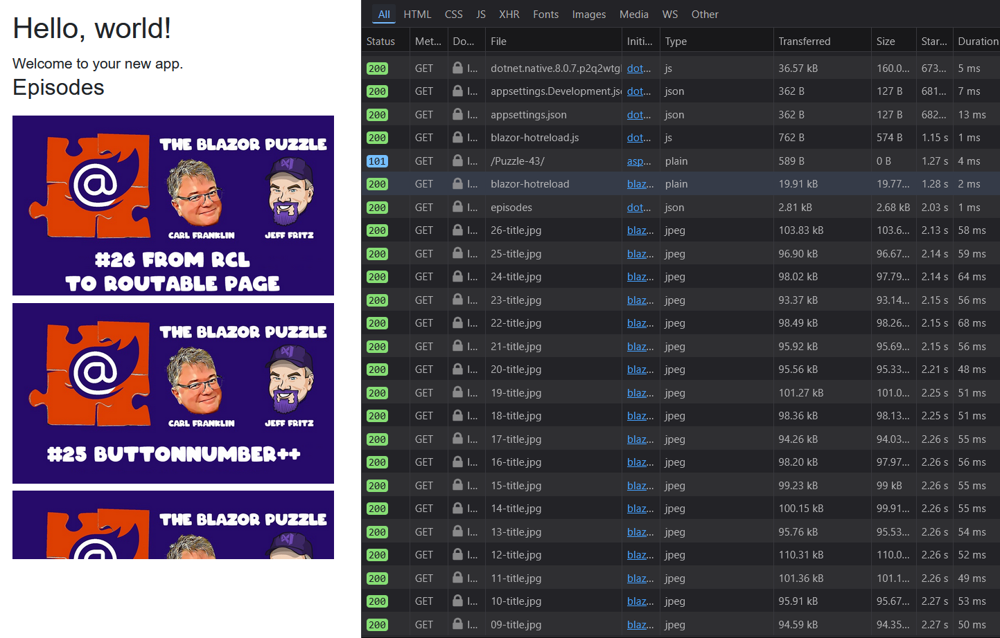

# Blazor Puzzle #43

## Virtually Overworked

YouTube Video: https://youtu.be/DfWTWkYXuGc

Blazor Puzzle Home Page: https://blazorpuzzle.com

### The Challenge:

I'm working with an API of Blazor Puzzle episodes and would like to show the list of all episodes in a virtualized scrollable list.  I used the virtualize component to wrap the list of Blazor Puzzle episodes, and its still loading a TON of episode thumbnails even though only 2 are visible on screen.

How can we curb the network traffic so that it only loads 4 episode thumbnails to start?

