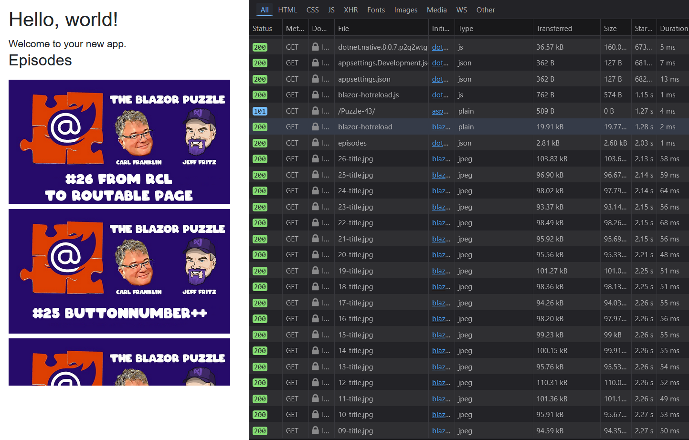

# Blazor Puzzle #43

## Virtually Overworked

YouTube Video: https://youtu.be/DfWTWkYXuGc

Blazor Puzzle Home Page: https://blazorpuzzle.com

### The Challenge:

I'm working with an API of Blazor Puzzle episodes and would like to show the list of all episodes in a virtualized scrollable list.  I used the virtualize component to wrap the list of Blazor Puzzle episodes, and its still loading a TON of episode thumbnails even though only 2 are visible on screen.

How can we curb the network traffic so that it only loads 4 episode thumbnails to start?



### The Solution:

The solution is to set the `OverscanCount` parameter to a lower value than the default, which is 3. We also need to set the `ItemSize` parameter to the height of our images, which is **200px**.

```html
<Virtualize Items="AvailableEpisodes" Context="episode" ItemSize="200" OverscanCount="2">
    <Placeholder>Loading ...</Placeholder>
    <ItemContent>
        
    </ItemContent>
</Virtualize>
```

Now, if you run the app you will see only 8 images (or so) are loaded, and when you scroll down, only a few more are loaded.

Boom!
